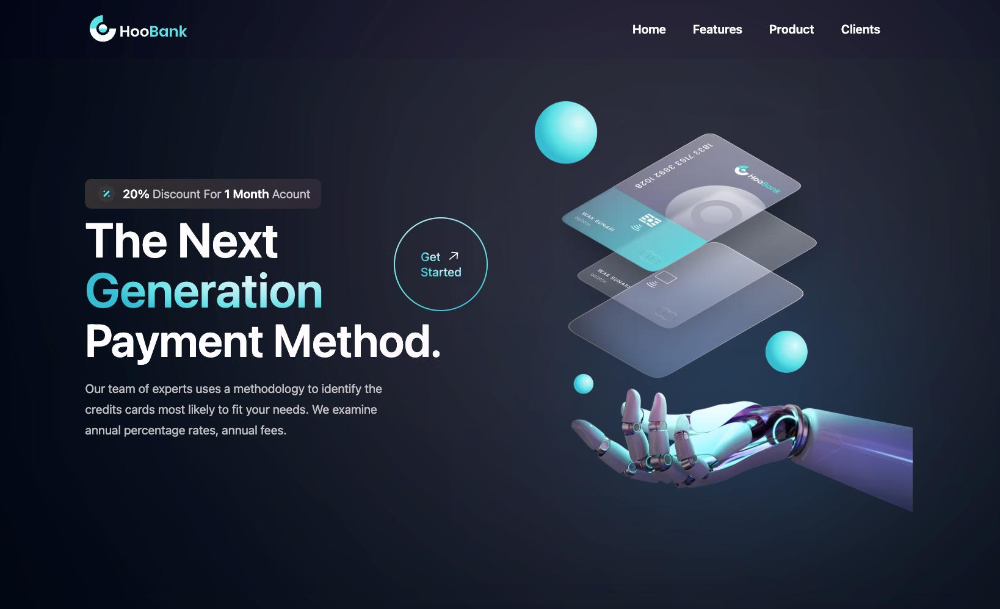

# Hoobank - Landing Page

Una landing page fintech moderna diseñada para presentar servicios de banca digital mediante una interfaz limpia y atractiva. El proyecto se centra en secciones de contenido estructuradas, componentes de interfaz modernos y un layout visual consistente que destaca las características y servicios financieros.

Construida con prácticas modernas de desarrollo frontend, la página enfatiza el diseño responsive, una jerarquía visual clara y una experiencia de usuario fluida en diferentes dispositivos.

## 🌐 Live Demo

Visita el sitio en vivo: **[https://alejandro-gr01.github.io/hoobank-landing/](https://alejandro-gr01.github.io/hoobank-landing/)**


## 📸 Preview




## 🚀 Características Principales

- **Diseño Responsivo**: Adaptado perfectamente para móviles, tablets y desktop
- **Animaciones Profesionales**: Implementadas con GSAP y ScrollTrigger para efectos suaves y performantes
- **Componentes Reutilizables**: Arquitectura modular y escalable siguiendo best practices de React
- **Estilos Modernos**: Tailwind CSS con clases utility para un diseño limpio y consistente
- **Performance Optimizado**: Vite proporciona HMR rápido y build optimizado
- **Imágenes Optimizadas**: Formato AVIF para mejor compresión y velocidad de carga
- **Lazy Loading**: Carga diferida de imágenes para mejorar el rendimiento
- **SEO Friendly**: Estructura semántica HTML para mejor indexación

## 📋 Componentes Implementados

### Componentes Principales
- **NavBar** - Navegación responsive con menú adaptable
- **Hero** - Sección principal con CTA y animaciones de entrada
- **Stats** - Estadísticas destacadas con números impactantes
- **Billing** - Planes de pago y opciones de servicios
- **CardDeal** - Promoción especial con diseño destacado
- **FeedBackCard** - Tarjetas de testimonios de clientes
- **Testimonials** - Sección de opiniones con carousel
- **Clients** - Logos de empresas asociadas
- **CTA** - Llamada a la acción final persuasiva
- **Footer** - Pie de página con información y enlaces

### Componentes Utilitarios
- **Button** - Botón reutilizable con estilos consistentes
- **GetStarted** - Componente de inicio rápido

## 🛠️ Tecnologías Utilizadas

### Frontend & UI
- **React 19** - Librería de interfaz de usuario moderna
- **Vite** - Build tool ultrarrápido y bundler con HMR en tiempo real
- **Tailwind CSS** - Framework de CSS utility-first para estilos modernos
- **React SWC** - Fast Refresh con SWC para compilación rápida

### Animaciones & Interactividad
- **GSAP (GreenSock Animation Platform)** - Librería profesional de animaciones
- **GSAP ScrollTrigger** - Control de animaciones basado en scroll
- **@gsap/react** - Integración nativa de GSAP con React hooks

### Tooling & Desarrollo
- **pnpm** - Gestor de paquetes rápido y eficiente
- **ESLint** - Validación de código y mejores prácticas
- **Vite Config** - Configuración optimizada para desarrollo y producción

### Características Implementadas
✅ Componentes modulares y reutilizables
✅ Sistema de animaciones sincronizadas con scroll
✅ Imágenes optimizadas en formato AVIF
✅ Diseño mobile-first completamente responsivo
✅ Navegación fluida y accesible
✅ Tarjetas de características con efecto parallax
✅ Secciones con transiciones suaves
✅ Botones interactivos con estados visuales
✅ Deploy automático en Netlify

## 📦 Instalación y Setup

### Requisitos
- Node.js 16+ 
- pnpm 8+ (o npm/yarn)

### Pasos de Instalación

```bash
# 1. Clonar el repositorio
git clone <repository-url>
cd hoobank

# 2. Instalar dependencias
pnpm install

# 3. Ejecutar en modo desarrollo
pnpm dev

# 4. Abrir en el navegador
# La aplicación estará disponible en http://localhost:5173
```

### Scripts Disponibles

```bash
# Desarrollo
pnpm dev           # Inicia servidor de desarrollo con HMR

# Producción
pnpm build         # Genera build optimizado para producción
pnpm preview       # Vista previa del build de producción
pnpm lint          # Valida el código con ESLint

# Deploy
# Deploy automático en Netlify al hacer push a main
```

## 🎨 Estructura del Proyecto

```
src/
├── components/           # Componentes React reutilizables
│   ├── Billing.jsx
│   ├── Busines.jsx
│   ├── Button.jsx
│   ├── CardDeal.jsx
│   ├── Clients.jsx
│   ├── CTA.jsx
│   ├── FeedBackCard.jsx
│   ├── Footer.jsx
│   ├── GetStarted.jsx
│   ├── Hero.jsx
│   ├── Navbar.jsx
│   ├── Stats.jsx
│   ├── Testimonials.jsx
│   └── index.jsx
├── constants/            # Configuración y datos constantes
│   └── index.js
├── assets/              # Imágenes y recursos estáticos
│   ├── numerosas imágenes en formato AVIF
│   └── ...
├── style.js             # Estilos globales y configuración de Tailwind
├── App.jsx              # Componente raíz
├── index.css            # Estilos globales CSS
└── main.jsx             # Punto de entrada

```

## 📱 Responsive Design

El proyecto utiliza **Tailwind CSS breakpoints** para proporcionar una experiencia óptima en todos los dispositivos:

- **Mobile** (< 640px): Diseño single column optimizado para touch
- **Tablet** (640px - 1024px): Layout de 2 columnas adaptado
- **Desktop** (> 1024px): Diseño completo multi-columna

Todas las secciones incluyen:
- Navegación responsiva con menú adaptable
- Tipografía escalable
- Espaciado flexible
- Imágenes optimizadas para cada resolución

## ✨ Animaciones con GSAP

### Implementaciones de Animaciones

- **ScrollTrigger**: Animaciones sincronizadas con el scroll
- **Timeline GSAP**: Secuencias complejas de animaciones coordinadas
- **Stagger Effects**: Efectos en cascada para elementos múltiples
- **Easing Functions**: Movimientos suave con diferentes curvas de animación

### Ejemplo de Uso (Componente Busines.jsx)

```javascript
useGSAP(() => {
  const timeline1 = gsap.timeline({
    scrollTrigger: {
      trigger: blockTextRef.current,
      start: "top 78%",
    },
  });

  timeline1
    .from(blockTextRef.current, {
      opacity: 0,
      x: -1000,
      duration: 1,
      ease: "power2.out",
    })
    .from(itemsRef.current, {
      opacity: 0,
      x: -100,
      duration: 1,
      stagger: 0.3,
      ease: "power2.out",
    }, "-=0.5");
}, []);
```

## 🚀 Performance & Optimización

- **Lazy Loading**: Imágenes cargadas bajo demanda con `loading="lazy"`
- **Formato AVIF**: Compresión de imagen moderna para carga rápida
- **Code Splitting**: Vite genera chunks optimizados automáticamente
- **CSS Utility Classes**: Tailwind genera solo el CSS necesario
- **HMR (Hot Module Replacement)**: Desarrollo rápido sin recarga de página

## 📊 Características SEO

- Estructura HTML semántica con etiquetas apropiadas
- Meta tags configurados en index.html
- URLs amigables
- Imágenes con atributos `alt` descriptivos
- Performance optimizado para Core Web Vitals

## 🎯 Mejoras Futuras

- [ ] Sistema de temas (dark/light mode)
- [ ] Internacionalización (i18n) - soporte multi-idioma
- [ ] Formularios de contacto funcionales
- [ ] Integración con Analytics (Google Analytics/Mixpanel)
- [ ] A/B Testing framework
- [ ] PWA (Progressive Web App) capabilities
- [ ] Blog integrado
- [ ] Sistema de CMS headless

## 🤝 Contribuciones

Las contribuciones son bienvenidas. Para cambios principales:
1. Fork el repositorio
2. Crea una rama para tu feature (`git checkout -b feature/AmazingFeature`)
3. Commit tus cambios (`git commit -m 'Add some AmazingFeature'`)
4. Push a la rama (`git push origin feature/AmazingFeature`)
5. Abre un Pull Request

## 📝 Licencia

Este proyecto está bajo licencia MIT. Ver `LICENSE` para más detalles.

## 👨‍💻 Autor

Desarrollado  por Alejandro Guzman

## 📞 Contacto & Soporte

Para reportar bugs o sugerencias, abre un issue en el repositorio.

---

**Última actualización**: 21 de Febrero de 2026
